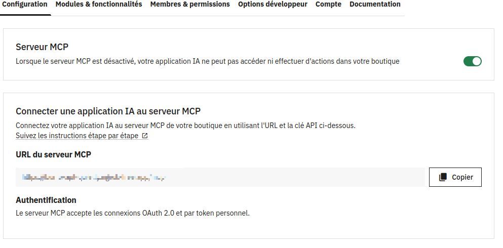
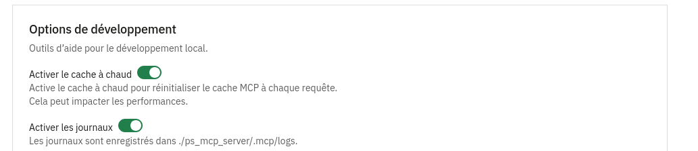
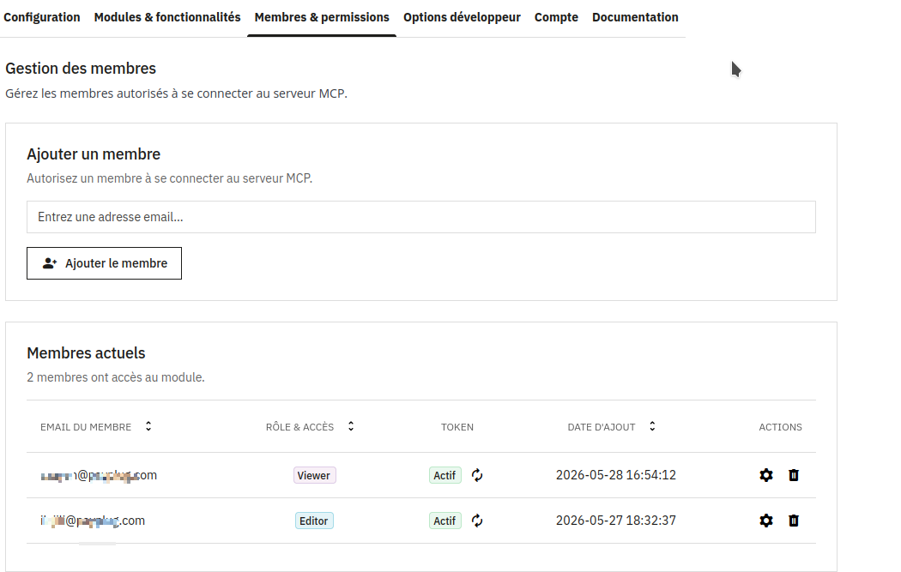
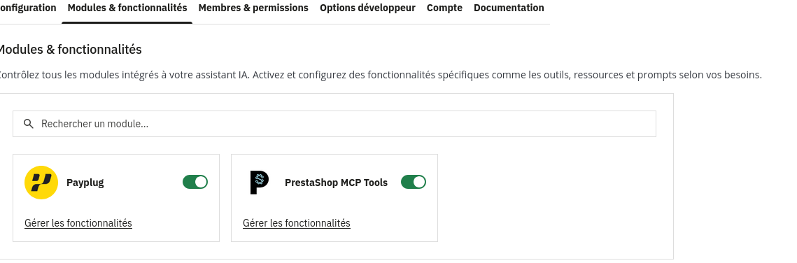

# Payplug MCP Server — Setup & Requirements Guide

> ** Payplug MCP tool: Payment linked tool for LLMs (Claude, chatgpt,gemini, etc.)**

---

## 🛠️ Prerequisites & Requirements

Before setting up the MCP environment and using the Payplug MCP tool, ensure your infrastructure meets the following baseline metrics:

---

### 1. Server Environment & PrestaShop Compatibility

* **PrestaShop Versions:** Fully compatible from **PrestaShop 8.2 up to 9.1**.
* **PHP Version Requirements:** PHP requirements depend strictly on your specific PrestaShop core version (starting from **PHP 8.1+**).

  > 💡 You can double-check the exact PHP compatibility matrix and module updates directly on the official module page: [PrestaShop MCP Server Addons](https://addons.prestashop.com/fr/outils-administration/96617-prestashop-mcp-server.html).

---

### 2. Core Modules & Dependencies

Your PrestaShop backend must have the following module dependencies **installed, updated, and initialized**:

* **`ps_mcp_server`**: Version `1.0.1` or higher.
* **`ps_accounts`**: You must have an active PrestaShop Account, and **your store URL must be fully linked/connected** to your `ps_accounts` profile.

---

### 3. Essential Store Configuration

To allow the MCP client to successfully read and write data, the following core parameters are required:

* **Enable PrestaShop Webservice:** You **must** enable the native PrestaShop Webservice engine. Navigate to *Advanced Parameters > Webservice* and switch **"Enable PrestaShop Webservice"** to **Yes**.

* **Network Visibility:** If you are developing or testing on a local environment (`localhost`), the store **must** be exposed to the internet via a public secure tunnel (e.g., **ngrok** or Localtunnel) with a valid HTTPS URL.

---

## ⚙️ Back Office (BO) Plugin Configuration

Once the modules are installed, navigate to the **SERVEUR MCP PRESTASHOP** configuration page in your PrestaShop Back Office to complete the setup:

---

### 1. Enable Debugging & Cache

* To ensure optimal performance and allow easy troubleshooting, make sure to **turn on both Logs and Cache** inside the module settings block.
  
---

### 2. Connect an AI Member & Generate Token

* Add a new members in section members & permissions as much as you want by entering the **exact email address** associated with the related ** `ps_accounts` profiles**.
* Generate a secure **Access Token**. This secret token will be required by your AI Client (such as **Claude Code**, **Claude Desktop**, or **Chatgpt**) to communicate with your shop.

---

### 3. Discover Available Tools

* Once successfully authenticated, you will be able to see the registered **Payplug Tools** listed directly within the *Modules & Features* dashboard section, ready to pass schemas over to your LLM context.
  
---

## 🔁 Setup Checklist

Use this checklist to verify your environment before going live:

- [ ] PrestaShop version is between **8.2 and 9.1**
- [ ] PHP version is **8.1 or higher**
- [ ] `ps_mcp_server` module installed at version **1.0.1+**
- [ ] Store URL **linked** to your ps_accounts`
- [ ] PrestaShop **Webservice is enabled** (*Advanced Parameters → Webservice*)
- [ ] The store **must** be exposed to the internet via a public secure tunnel(use ngrok / Localtunnel for local dev)
- [ ] **Logs and Cache** are enabled in the module settings
- [ ] A member has been added with the **correct `ps_accounts` email**
- [ ] **Access Token** has been generated and stored securely
- [ ] Payplug Tools are visible in the **Modules & Features** dashboard

